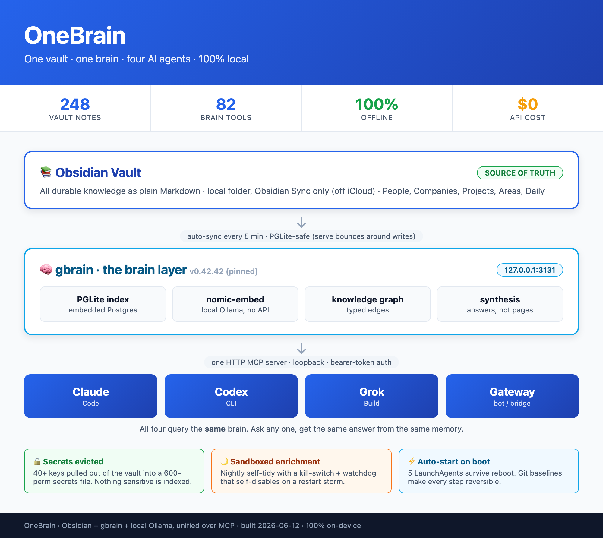

# OneBrain

**One Obsidian vault → one local brain → every AI agent sharing the same memory. 100% on-device, $0 API.**

OneBrain is a thin, reproducible **setup layer** that puts all of your AI agents
(Claude Code, Codex, Grok, a self-hosted gateway/bot, Claude Desktop/Cowork) on a
*single shared memory* served from your own machine over MCP. Edit a fact once in
Obsidian and all of them see it.

It is not a new database or model. The actual brain is **[gbrain](https://github.com/garrytan/gbrain)**.



---

## Credit: gbrain by Garry Tan

> The entire intelligence layer here — the index, the knowledge graph, the synthesis,
> and the ~80 MCP tools — is **[gbrain](https://github.com/garrytan/gbrain)**, the
> open-source local-brain project by **[Garry Tan](https://github.com/garrytan)**.
> OneBrain is just the operational wrapping around it: launchd services, a
> PGLite-safe sync loop, offline embeddings, secret hygiene, sandboxed enrichment,
> multi-agent wiring, and the install scripts.
>
> **All credit for the hard part goes to Garry Tan and the gbrain project.** If you find
> OneBrain useful, go star [github.com/garrytan/gbrain](https://github.com/garrytan/gbrain).

OneBrain pins a specific gbrain version for reproducibility (see [Prerequisites](#prerequisites)).
gbrain is licensed under its own terms; this repo's MIT license covers only the wrapper
scripts, LaunchAgents, installer, and docs in *this* repository.

---

## The problem

Run several AI agents day to day and each one keeps its *own* memory. The same facts
about your world — people, companies, projects, preferences — live in 4+ places, drift
apart, and there's no single place to ask. Classic agent amnesia, times four.

## The shape

```
            Obsidian vault  (Markdown — the only durable store)
                  │   auto-sync every 5 min (PGLite-safe: serve bounces around writes)
                  ▼
   gbrain  (PGLite index + nomic-embed via Ollama + knowledge graph + synthesis)
                  │   one HTTP MCP server · 127.0.0.1 · bearer-token auth
                  ▼
   Claude Code · Codex · Grok · Cursor · Qoder · Warp · your gateway/bot · Claude Desktop
                  └────────── all query the SAME brain ──────────┘
                  ▲                                              │
                  │  Rules injected at session start             │ transcripts (read-only)
                  │                                              ▼
        Agent Lessons note  ◀────── nightly: local model finds contradicted claims
                  ▲
                  │  heartbeat every run, even on zero-lesson nights
        ai.gbrain.doctor ──▶ notify: Telegram · macOS · log
```

- **Source of truth:** your Obsidian vault. Plain Markdown. Agents read it and write
  durable facts back into it.
- **Brain layer:** [gbrain](https://github.com/garrytan/gbrain) — indexes the vault into
  PGLite (embedded Postgres), builds a typed knowledge graph, exposes ~80 tools over MCP.
- **Embeddings:** `nomic-embed-text` in **Ollama**. Zero external API, nothing leaves the
  machine, $0 per query.
- **Clients:** every agent wired to the one HTTP MCP endpoint, each in its own config.

The diagram above is also an interactive HTML card in [`docs/architecture.html`](docs/architecture.html).
For the story of how and why this was built, see [`docs/how-i-built-this.md`](docs/how-i-built-this.md).

## Orchestration (optional, recommended)

The brain is passive — so you can put any agent *in charge* of it. Designate one agent as an
**orchestrator** that runs on a schedule, reads context from the brain, dispatches work to the
others, and writes results back to the vault. Two real, MCP-native runtimes with built-in cron
and sub-agent fan-out are documented end to end in [`docs/orchestrator.md`](docs/orchestrator.md):

- **[OpenClaw](https://docs.openclaw.ai/)** — gateway + agent runtime, multi-agent routing.
- **[Hermes (Nous Research)](https://hermes-agent.nousresearch.com/docs/)** — autonomous agent, built-in cron, spawns subagents.

Each connects to OneBrain as a remote HTTP MCP server with one config block (exact syntax for
both in the doc). You don't *need* one — any worker agent can orchestrate on-demand — but an
orchestrator makes the loop persistent and scheduled.

## What's in this repo

```
bin/                    wrapper scripts (serve, sync, enrichment, sentinel, lessons, notify, env, bridge)
launchagents/           macOS LaunchAgents (auto-start, survive reboot)
tools/onebrain-agents.sh  detect installed agents and wire them to the brain
config/eval-queries.txt   probe set for the nightly contradiction check
docs/clients.md         how to wire Claude / Codex / Grok / a gateway / Claude Desktop
docs/orchestrator.md    put an agent in charge: OpenClaw / Hermes (Nous) integration
docs/troubleshooting.md every lesson that bit during the build
docs/architecture.html  the architecture infographic
install.sh              one-command install (idempotent)
uninstall.sh            clean removal (leaves your vault + secrets + DB intact)
.env.example            secrets template, copy to ~/.secrets/.env
```

Nothing here contains a secret. The scripts read tokens from `~/.secrets/.env` at runtime.

## Prerequisites

| Need | Why | Install |
|------|-----|---------|
| macOS | LaunchAgents / launchd | — |
| [Bun](https://bun.sh) | runs gbrain | `curl -fsSL https://bun.sh/install \| bash` |
| [Ollama](https://ollama.com) + embed model | offline embeddings | `ollama pull nomic-embed-text` |
| [gbrain](https://github.com/garrytan/gbrain) | the brain | clone to `~/Code/gbrain`, pin a version (below) |
| [Obsidian](https://obsidian.md) + a vault under `git` | source of truth | move the vault off iCloud; `git init` inside it |
| (optional) [Obsidian Sync](https://obsidian.md/sync) | multi-device | connect the *relocated* vault to your existing remote |

Pin gbrain for reproducibility, e.g.:

```bash
git clone https://github.com/garrytan/gbrain ~/Code/gbrain
cd ~/Code/gbrain && git checkout <the-commit-you-tested> && bun install
```

> This setup was built and tested against gbrain **v0.42.65.0**. Treat the pin as a gate:
> re-test the sync/serve/enrichment loop before upgrading.
>
> Upgrade procedure that worked (2026-07-24, v0.42.42.0 to v0.42.65.0, 369 commits):
> stop `ai.gbrain.server` so the PGLite lock is free, copy `brain.pglite` aside, rebase any
> local patches onto upstream, `bun install`, `bun run src/cli.ts apply-migrations --yes`,
> `jobs smoke`, restart serve, then compare `get_health` against the pre-upgrade numbers.
> Note that `apply-migrations` runs its smoke phase by shelling out to a `gbrain` binary on
> PATH; if you deliberately have no such binary, that phase fails while the migrations
> themselves have already applied. Run `bun run src/cli.ts jobs smoke` yourself to confirm.

## Install

```bash
# 1. secrets
cp .env.example ~/.secrets/.env && chmod 600 ~/.secrets/.env
$EDITOR ~/.secrets/.env          # set tokens + OBSIDIAN_VAULT_PATH + GBRAIN_REPO

# 2. one-time index of your vault (serve must be stopped; PGLite single-writer)
cd ~/Code/gbrain && env -u OPENAI_API_KEY bun run src/cli.ts sync --repo "$OBSIDIAN_VAULT_PATH"

# 3. install services (add --enrichment for the nightly sandboxed self-tidy)
./install.sh
```

Verify:

```bash
launchctl print gui/$(id -u)/ai.gbrain.server | grep state
curl -s -H "Authorization: Bearer $GBRAIN_REMOTE_TOKEN" http://127.0.0.1:3131/health
```

Then wire your agents — [`docs/clients.md`](docs/clients.md).

## What you get

- **Shared memory** across every agent, queryable in natural language.
- **100% offline** — embeddings and storage never leave the machine; no per-query cost.
- **Survives reboot** — LaunchAgents auto-start; works before you even sign in to apps.
- **Safe by construction** — secrets evicted from the vault, loopback + bearer auth,
  PGLite-safe sync, and a sandboxed enrichment daemon with a kill-switch + watchdog.
- **Reversible** — your vault is plain Markdown under git; the gbrain DB is a rebuildable index.
- **Verified, not assumed** — a daily sentinel that refuses to absorb its own regressions, an
  off-machine vault backup on every commit, and a wiring report that checks config against reality.
- **Learns from being wrong** — nightly local extraction of contradicted claims into one
  vault note whose Rules every agent reads at session start, watched by a heartbeat that
  cannot fail silently.

## Wiring agents (and checking they are actually wired)

```bash
tools/onebrain-agents.sh          # report which installed agents can reach the brain
tools/onebrain-agents.sh --wire   # wire the ones that cannot
tools/onebrain-agents.sh --json   # machine-readable, for a cron or dashboard
```

It detects Claude Code, Codex, Grok, Cursor, Qoder, QoderWork, Warp, Hermes, opencode and
Antigravity, writes each one's native format (JSON `mcpServers` or TOML `[mcp_servers.*]`),
backs the config up first, and only ever touches the `gbrain` entry. It is idempotent, so it
is safe on a cron. Agents whose MCP schema it cannot verify are reported as `MANUAL` rather
than written to blindly.

**Why this exists.** An audit on 2026-07-24 found this project's own architecture diagram
claiming four agents were wired while the busiest one, Claude Code, had zero MCP servers
configured and no occurrence of the string `gbrain` anywhere in its config. Nine of twelve
installed agents could not reach the brain their own instruction files named as the source of
truth. Documentation drifted from reality because nothing compared the two. Run the report,
do not trust the diagram.

## Verification: the part that actually keeps this honest

A memory system fails quietly. Nothing errors, answers just get subtly wrong. Every real
fault found in this stack was silent:

| Fault | How it presented |
|---|---|
| Claude Code never wired to MCP | Its instructions said "check the brain first". It had no tools to do so. |
| Vault had no off-machine copy | Git dir sat on the same disk, zero remotes, no Time Machine destination. |
| Backup repo on the second machine | Created once, one commit, never pushed again for six weeks. |
| Nightly contradiction check | Invoked with no arguments, failed on a usage error every single night. |
| Knowledge-health regression | Alerted once to a logfile nobody reads, then the rolling baseline absorbed it. |
| Configured chat model | Named a model that was not installed; and when installed, thrashed at 0.8 tok/s. |

So the wrapper ships three checks:

- **`bin/gbrain-sentinel.sh`** (`ai.gbrain.doctor`, daily): queries the running server over
  MCP, compares against `~/.gbrain/health-baseline.json`, and on regression writes
  `~/.gbrain/ALERT.json`, sends a push notification, and **holds the baseline at the last
  known-good values** so the regression keeps alerting until it is genuinely fixed. Only a
  clean run advances the baseline. Delete the baseline file to accept new numbers on purpose.
- **Off-machine backup** inside `bin/gbrain-sync.sh`: mirrors the vault git to a second
  machine on every changed commit, connection-bounded and non-fatal so an unreachable target
  can never stall or fail brain sync.
- **`config/eval-queries.txt`**: questions about facts that actually go stale in your world,
  fed to `gbrain eval suspected-contradictions` nightly. Runs fully local at $0.

If you take one thing from this repo, take the sentinel pattern. A detector that heals its
own alarm is worse than no detector, because it looks like everything is fine.

## Lessons: the agents learn from being wrong

Agents assert things that turn out false. Usually not reasoning failures — verification
failures: asserting without checking, or checking partially and reporting as if fully.
Those corrections are worth keeping, and they are worth sharing across every agent.

- **`bin/gbrain-lessons.sh`** (`ai.gbrain.lessons`, nightly 03:05) scans the last 24h of
  agent transcripts **read-only**, asks a local model (`gemma3:4b` via Ollama) to find
  claims that were later contradicted, and appends them to one vault note. Fully offline,
  no per-run cost.
- **The vault note** holds two sections: **Rules** (hard-capped, binding, injected at every
  session start) and an append-only **Log** they were distilled from. It lives in the vault,
  so every agent reads the same rules and a brain rebuild cannot destroy them.
- **`bin/onebrain-notify.sh`** is the one place that knows how to reach a human: Telegram,
  macOS notification, and a log file. Each channel is optional and no-ops silently when
  unconfigured. gbrain has no notification layer of its own, so this belongs to the wrapper.
  Configure in `~/.onebrain/notify.env` — see `.env.example`.

**Why this one is watched harder than anything else here.** The previous attempt at this
captured nothing for three months. Its observation hooks were registered in a plugin that
was not installed, so they never fired, and nothing reported the silence. It looked healthy
the entire time.

So the watchdog was built **before** the pipeline it watches. `ai.gbrain.doctor` alerts when
the lessons heartbeat is missing, older than 48h, reports an error, **or reports zero
sessions scanned while transcripts were changing** — the signature of a job that exits clean
while observing nothing. It ships alarmed and can only go green once the pipeline genuinely
runs and writes a heartbeat.

That ordering is the point: **a monitored system that starts in the alarmed state cannot
ship dead.** The heartbeat is written on every exit path including zero-lesson nights, so
"nothing to learn" and "capture is dead" stay distinguishable.

One consequence worth internalising: a quiet night and a broken extractor produce identical
output. Test the extractor with a planted contradiction before trusting a zero.

## Choosing a local chat model

`chat_model` is only needed for the synthesis and dream tiers, not for search or embeddings.
Size it to the machine, and measure rather than trusting `ollama ps`, which reports
"100% GPU" even while the model is thrashing through swap.

Measured on a Mac mini M4 / 16GB:

| Model | Generation | Verdict |
|---|---|---|
| `gemma4:12b-mlx` (7.7GB) | **0.8 tok/s**, swap at 12.9GB of 14.3GB | Unusable. MLX builds thrash once resident size approaches the wired limit. |
| `gemma3:4b` (3.3GB) | **31.8 tok/s** | Fits comfortably, 40x faster. |

The larger model is not the better model when it does not fit.

## Multi-machine

Run the same install on a second Mac. Keep the vault in sync with Obsidian Sync (each
machine runs its *own* gbrain index over the same Markdown, so page counts converge rather
than match instantly). Run the heavier `--enrichment` agent on **one** machine only.

## Security notes

- Tokens live only in `~/.secrets/.env` (chmod 600) and are read at runtime. Never commit them.
- The MCP server binds to `127.0.0.1` and still requires a bearer token.
- Keep secrets *out* of the indexed vault — anything indexed is visible to every wired agent.
- See [`docs/troubleshooting.md`](docs/troubleshooting.md) for the full list of footguns.

## License

MIT (this repo's wrapper code/docs) — see [LICENSE](LICENSE).
The brain itself, **[gbrain](https://github.com/garrytan/gbrain) by Garry Tan**, is a
separate project under its own license. Please credit it.
